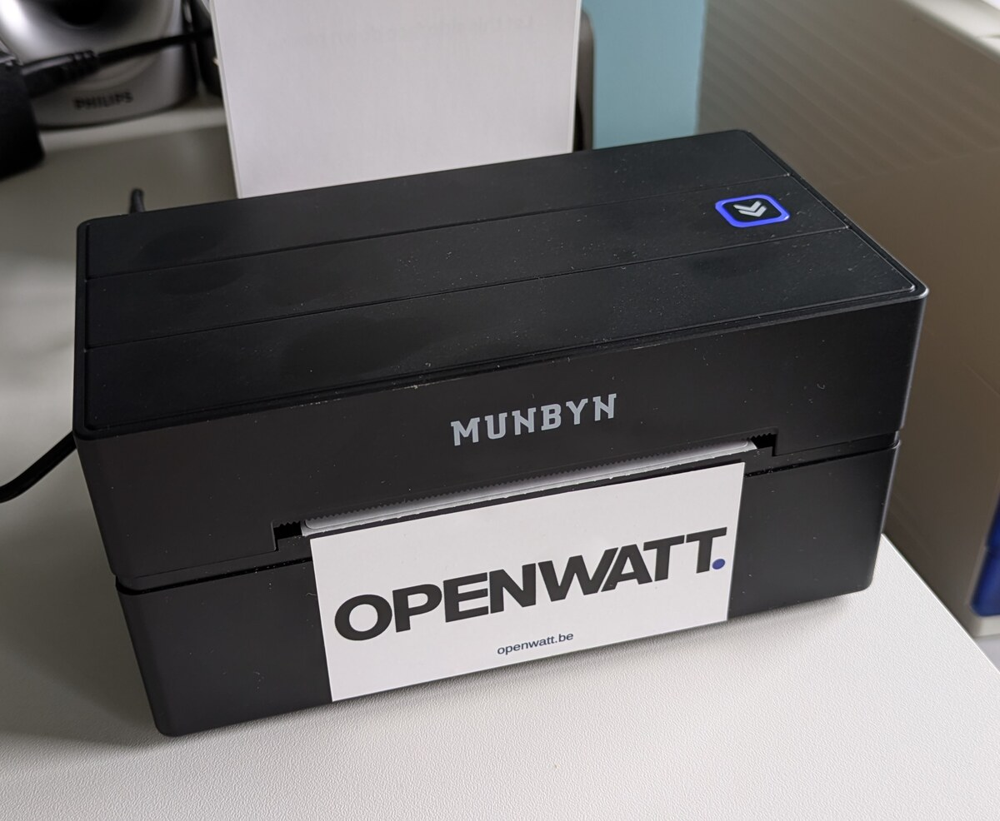

# MUNBYN ITPP130B BLE CUPS Driver

An open-source CUPS backend and filter for printing to the MUNBYN ITPP130B
thermal label printer over Bluetooth Low Energy on Linux.



## Features

- Direct BLE GATT printing through a CUPS backend
- PDF and PostScript rasterization at 203 dpi
- Plain-text to TSPL conversion
- Multi-page PDF support
- Landscape and portrait orientation handling
- Chunk pacing for the printer's BLE receive buffer

## Requirements

- Arch Linux or another system with CUPS and BlueZ
- Python 3.10 or newer
- `bleak`
- `cups`, `bluez`, and `bluez-utils`
- `poppler` for PDF rasterization
- `ghostscript` for PostScript conversion

The installer currently uses `pacman`, so Arch Linux or a compatible
distribution is required for the automated setup.

## Install

Power on the printer, load the labels, and close the cover. Then run:

```bash
sudo env TARGET_USER="$USER" ./setup.sh
```

The installer scans for the BLE advertisement, installs the backend, filter,
and PPD, and creates the CUPS printer `Printer_ITPP130`.

If the printer is not found, make sure it is ready and advertising. A power
cycle may be required after system sleep.

## Print

The printer should appear in desktop print dialogs as `Printer_ITPP130`.
For a terminal test:

```bash
printf 'Hello from CUPS\n' | lp -d Printer_ITPP130
lp -d Printer_ITPP130 document.pdf
```

The configured default is 100 x 150 mm media at 203 dpi. For labels mounted
side-by-side on the roll and entering the printer short-edge-first, select
**Landscape** in the application print dialog.

BLE printing can take up to 30 seconds, depending on the job size. The printer
LED is **green while busy** and **blue when ready**. CUPS may report the job as
complete when the BLE writes finish; the printer does not provide a reliable
print-completion acknowledgement.

## Architecture

```text
Application
    |
    v
CUPS filter: PDF/PostScript/text -> TSPL
    |
    v
CUPS backend: TSPL -> BLE GATT characteristic
    |
    v
ITPP130B printer
```

The verified data characteristic is:

```text
0000fff2-0000-1000-8000-00805f9b34fb
```

The backend also recognizes the ISSC UART write characteristic as a fallback.

## Development

Run the tests without requiring a printer:

```bash
python -m unittest discover -v
```

Hardware testing requires a powered-on printer and a working BLE adapter.

## Limitations

- The driver is currently tuned for the ITPP130B and TSPL-compatible devices.
- BLE discovery can be intermittent; power-cycling the printer usually restores
  advertising.
- Firmware may advance one extra blank label after some jobs.

## License

MIT. See [LICENSE](LICENSE).
